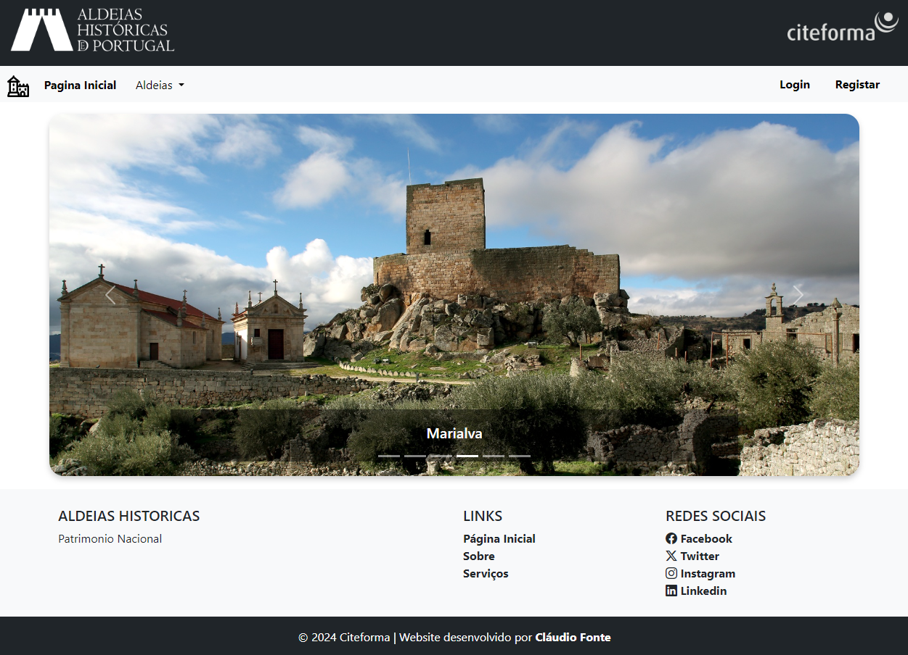

Historical Villages

This project is a web application showcasing historical villages (Aldeias Históricas) of Portugal. The website is built using HTML, CSS, and Bootstrap, providing a responsive and visually engaging experience. It includes sections for each featured village, a carousel for image highlights, and a navigation menu with dropdowns. Additionally, users can log in or register to personalize their experience.

Example 1

Example 2

